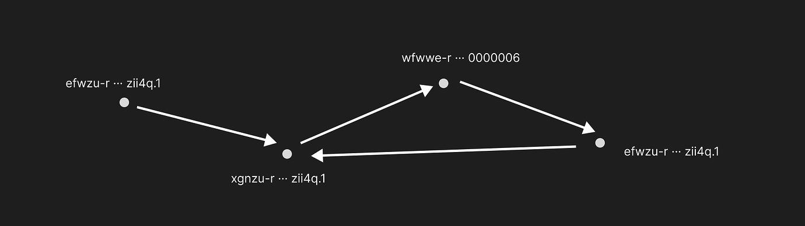

# DeFi

## Technical Working Group

---

# Goals

- Simplify the creation of DeFi services

- Enhance interoperability and collaboration. Setting ICRC standards and offering libraries that are easy to use, secure, and reliable.

- Increase awareness of DeFi on ICP. Bringing ICP DeFi projects to relevant platforms like Dexscreener.

---

# Key Performance Indicators (KPIs)

## A rise in the quantity of DeFi services

## An increase in the interconnectivity volume among these services

---

# Coordination

Meetings will take place within the ICP Developer Community Discord at ICP Developer Community.

---

## Overview ICRC-45 [Live DEX Data]

The ICRC-45 standard is conceived to standardize interfaces for decentralized finance (DeFi) applications operating on the Internet Computer. This standard aims to provide a unified framework for the exchange and representation of live market data, such as current token exchange rates, trading volumes, and market depth.

https://forum.dfinity.org/t/icrc-38-live-dex-data/26417

---

## Overview ICRC-47 [DEX History]

The goal is to establish uniform interfaces for accessing DEX exchange history. This standardization will facilitate third-party developers in creating applications and canisters for decentralized finance (DeFi) purposes. This will help the IC DeFi ecosystem to grow and increase its networking effect.

https://forum.dfinity.org/t/icrc-40-dex-history/26477

---

## Overview ICRC-55 [DeFi Vector]



```js
ledger.onReceive(func (t) = ignore ledger.send({ to = t.from; amount = t.amount; from_subaccount = t.to.subaccount; }));
```

---

A DeFi Vector has a source address and a destination address.
The source address is controlled by the vector agent (canister).
The destination address can be anywhere and doesn’t have to be controlled by the agent.
Vectors are first set up inside the agent and then used simply by sending tokens to their source address. No other communication is required for them to move tokens to the destination.
They are automatic agents using heartbeats or timers.

https://forum.dfinity.org/t/icrc-55-defi-vectors/27209

---

## Float or Nat?

Determining the appropriate data types for:

- Amounts - Nat
- Rates - Float
- Volume - Nat
- Market depth - Float

---

## Representation Strategies for Volume

Options for depicting trading volume:

- In USD
- In XDR
- With a single token
- With two tokens

---

## Volume Calculation Methodologies

Methods for accurately calculating volume using a rolling 24-hour window for both tokens.

---

## Market Depth Representation

Techniques for accurately depicting market depth information.

---

## Demo of DeVeFi ICRC Ledger Client library and how it works

```js
let ledger = L.Ledger(lmem, "mxzaz-hqaaa-aaaar-qaada-cai");

ledger.onReceive(func (t) = ignore ledger.send({ to = t.from; amount = t.amount; from_subaccount = t.to.subaccount; }));

```

https://forum.dfinity.org/t/devefi-ledger-icrc-ledger-client-library/27274

## Test results

Throughput per ledger
Sending - to lib queue - unlimited
Sending - from queue to ledger: 91tx/s
Read - from ledger - 250tx/s

---

https://github.com/Neutrinomic/ntn_airdrop_sns

https://github.com/Neutrinomic/devefi_backpass

https://github.com/Neutrinomic/defivectors

---

## Polling pattern in ICRCs

Should we use the same polling (read/write) pattern in other ICRCs?

---

## WG repo GitHub

Neutrinomic/wg_defi

https://forum.dfinity.org/t/defi-working-group/27350/5
